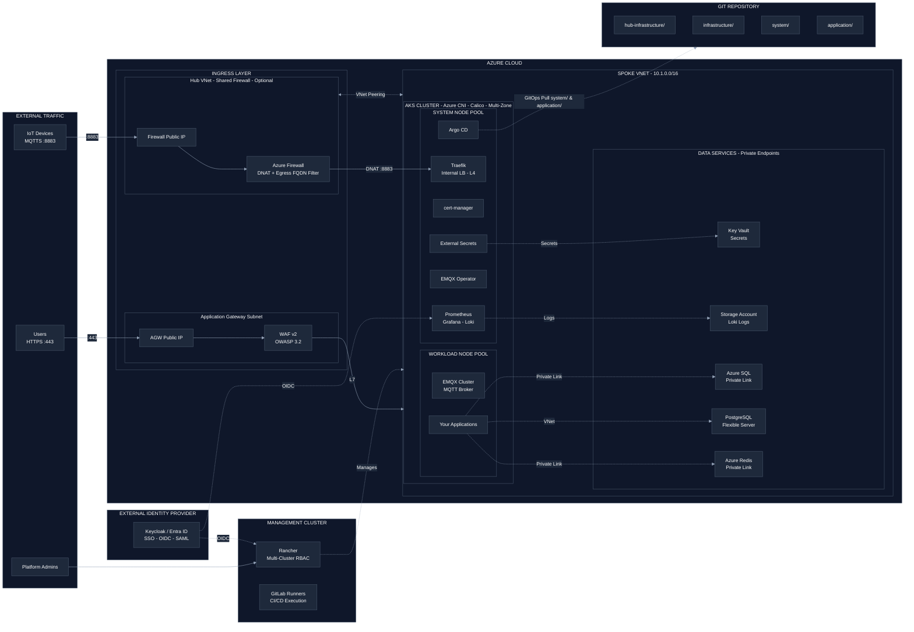
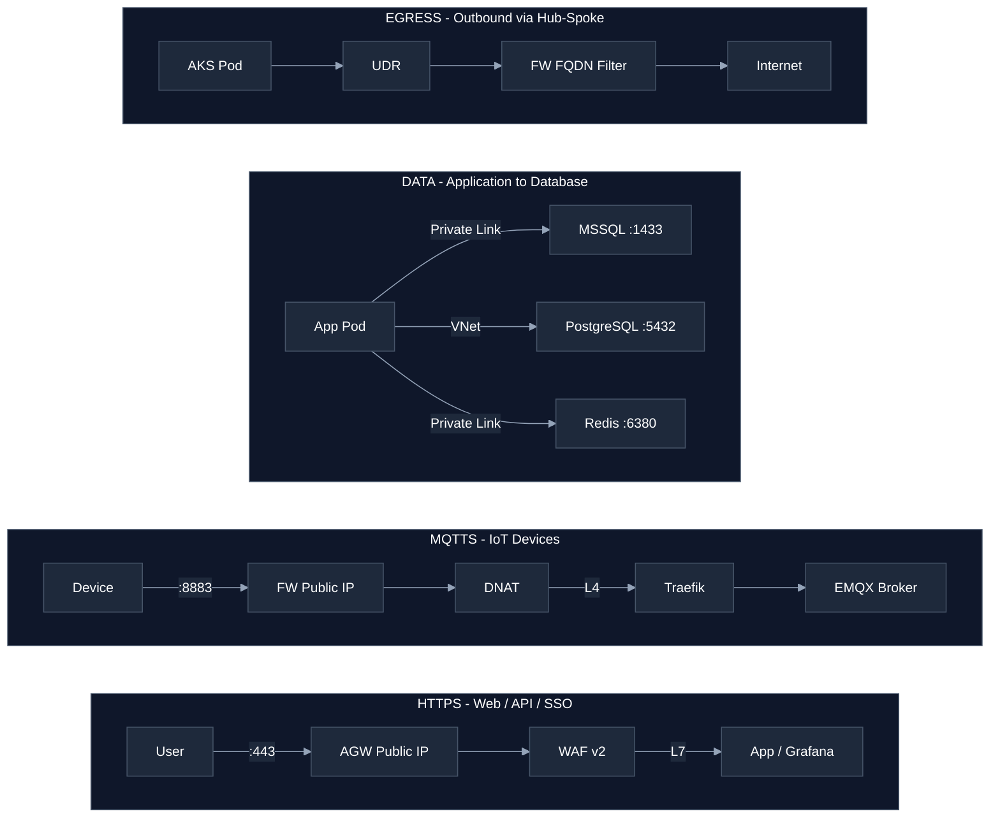

## Timeline & Info

| Start date | End date | Status | Associated with | Resources |
|---|---|---|---|---|
| 2024 | Present | Active | Personal side project | [GitHub](https://github.com/ajanach/azure-aks-gitops-boilerplate) |

## Overview

Engineered a production-ready **Azure Kubernetes Service** boilerplate that combines Terraform-provisioned hub-spoke networking with pull-based GitOps via **Argo CD**, delivering a fully reproducible platform deployable from a single `git push`.
Designed the architecture around seven independent security layers - from WAF OWASP 3.2 at the perimeter to Calico network policies and zero secrets in Git - while integrating managed data services (**Azure SQL**, **PostgreSQL**, **Redis**) through private endpoints.
Implemented centralized multi-cluster management with **Rancher**, external SSO via **Keycloak / Entra ID**, IoT MQTT messaging through an EMQX operator, and a complete observability stack with Prometheus, Grafana, and Loki backed by Azure Blob Storage.

## Architecture

The platform is organized across two provisioning domains and a management layer:

- **Hub VNet (optional shared firewall)**
  - Azure Firewall with DNAT rules and FQDN-based egress filtering
  - Hub to Spoke VNet peering
- **Spoke VNet - AKS cluster (Azure CNI + Calico, multi-zone)**
    - System node pool: Argo CD, Traefik, cert-manager, External Secrets Operator, EMQX Operator, Prometheus + Grafana + Loki
  - Workload node pool: EMQX Cluster, application deployments
  - Data services: Azure SQL, PostgreSQL Flexible Server, Azure Redis - all via private endpoints
- **Management Cluster**
  - Rancher for multi-cluster RBAC and developer access
  - GitLab Runners for CI/CD pipeline execution

### Platform Overview

### Traffic Flows

## Implementation

### Infrastructure as Code

Provisioned the complete Azure networking topology with **Terraform** - Spoke VNet, subnets, NSG rules, Application Gateway WAF v2 with 10 security headers, AKS cluster with system and workload node pools, Key Vault with RBAC, private endpoints for all data services, and managed identities for workload authentication.
Structured the IaC into two independent Terraform roots (`hub-infrastructure/` and `infrastructure/`) to allow hub-spoke deployments to be adopted incrementally, keeping single-cluster setups simpler while enabling full enterprise network topology when needed.

### CI/CD Pipeline

Implemented a **GitLab CI/CD** pipeline with five ordered stages: `secret-detection` - `validate` - `plan` - `apply` (manual gate) - `destroy` (manual gate).
Integrated **Gitleaks** as the first pipeline stage to block secrets from reaching the Terraform plan, ensuring the repo remains safe to share and audit at any point in the lifecycle.

### GitOps with Argo CD

Deployed the **App of Apps pattern** where a single root Argo CD application bootstraps all 10 platform applications from the `system/argocd/applications/` directory.
This approach means every platform service - Traefik, cert-manager, External Secrets, monitoring, Loki, EMQX Operator - is self-managed through Git, with Argo CD continuously reconciling live cluster state against the repository.

### Secrets Management

Implemented **zero secrets in Git** by routing all sensitive values through **External Secrets Operator** backed by **Azure Key Vault**.
A `ClusterSecretStore` authenticates to Key Vault using a managed identity, and individual `ExternalSecret` resources in `system/` and `application/` pull values at runtime - covering storage keys, Grafana admin credentials, Git repository tokens, and application secrets.

### Networking & Ingress

Configured dual ingress paths:

- **HTTPS** - Application Gateway WAF v2 (AGIC) for L7 traffic with OWASP 3.2 Prevention mode and TLS termination
- **MQTTS** - Azure Firewall DNAT on port 8883 forwarding to Traefik internal load balancer, which routes to the EMQX cluster

cert-manager handles automated TLS lifecycle for both paths using ClusterIssuers targeting Let's Encrypt.

## System Components

| Layer | Components |
|---|---|
| Cloud perimeter | Application Gateway WAF v2, Azure Firewall (DNAT + FQDN egress) |
| IaC | Terraform (hub-infrastructure/, infrastructure/) |
| CI/CD | GitLab CI/CD, Gitleaks secret scanning |
| Kubernetes | AKS (multi-zone, auto-upgrade, Azure CNI, Calico) |
| GitOps | Argo CD (App of Apps), self-managed via Git |
| Ingress | AGIC (L7 HTTPS) + Traefik (L4 MQTTS) |
| TLS | cert-manager + Let's Encrypt |
| Secrets | External Secrets Operator + Azure Key Vault |
| Identity / SSO | Keycloak / Entra ID (OIDC for Grafana, Rancher) |
| Data services | Azure SQL, PostgreSQL Flexible Server, Azure Redis |
| Messaging | EMQX (via Kubernetes Operator) |
| Observability | Prometheus, Grafana, Alertmanager, Loki, Grafana Alloy |
| Cluster management | Rancher (multi-cluster RBAC) |

## Security Design

Implemented seven independent defense layers with centralized identity:

| Layer | Control |
|---|---|
| CI/CD pipeline | Gitleaks secret scanning, manual approval gates for apply and destroy |
| Network perimeter | Azure Firewall egress FQDN whitelisting + DNAT for IoT |
| WAF | OWASP 3.2 in Prevention mode + 10 security response headers |
| Network segmentation | NSG per subnet, VNet isolation, private endpoints for all databases |
| Pod networking | Calico network policies, Argo CD default-deny ingress |
| Secrets | Zero secrets in Git - ESO pulls from Key Vault at pod runtime |
| Identity | External Keycloak / Entra ID SSO, Rancher RBAC, Azure managed identities |

## Key Results

| Metric | Result |
|---|---|
| **Platform services** | 10 Argo CD-managed applications, all Synced / Healthy from Day 1 |
| **Security layers** | 7 independent defense layers from perimeter to pod |
| **Secrets posture** | Zero secrets stored in Git - all runtime-injected via ESO + Key Vault |
| **Rebuild time** | Full platform reproducible from `git push` through Terraform + Argo CD bootstrap |
| **Ingress coverage** | Dual-path ingress: L7 HTTPS WAF + L4 MQTTS for IoT workloads |
| **Observability** | Full metrics, alerting, and log aggregation stack deployed via GitOps |
| **IaC coverage** | 100% of infrastructure declared in Terraform - no manual portal configuration |

## Tech Stack

| Category | Technologies |
|---|---|
| Infrastructure as Code | Terraform >= 1.3.2, AzureRM provider ~> 4.56 |
| Cloud | Azure (AKS, VNet, Application Gateway, Firewall, Key Vault, Storage, SQL, Redis, PostgreSQL) |
| CI/CD | GitLab CI/CD, Gitleaks |
| Kubernetes | AKS (multi-zone, auto-upgrade, Azure CNI, Calico network policies) |
| GitOps | Argo CD (App of Apps pattern) |
| Cluster management | Rancher |
| Ingress & TLS | Application Gateway (AGIC), Traefik, cert-manager, Let's Encrypt |
| Secrets | External Secrets Operator, Azure Key Vault |
| Identity | Keycloak, Microsoft Entra ID, Azure Managed Identities |
| Messaging | EMQX (Kubernetes Operator) |
| Observability | Prometheus, Grafana, Alertmanager, Loki, Grafana Alloy |

## Skills Demonstrated

Infrastructure as Code, Azure Cloud Architecture, Kubernetes Platform Engineering, GitOps Design, CI/CD Pipeline Automation, Secret Management, Network Security, WAF Configuration, Multi-Cluster Management, Identity Federation, Observability Engineering, Declarative Configuration, Technical Documentation