## Timeline & Info

| Start date | End date | Status | Associated with | Resources |
|---|---|---|---|---|
| 2025 | Present | Active | Personal side project | [GitHub](https://github.com/ajanach/homelab-hybrid-cloud-automation) |

## Overview

Architected a production-grade hybrid homelab that combines **Oracle Cloud Infrastructure** Always Free Tier with an on-premise Windows 11 + WSL2 Rocky Linux server through a **WireGuard** site-to-site VPN.
Implemented fully reproducible infrastructure provisioning with **Terraform** and idempotent service deployment with **Ansible**, enabling 22+ self-hosted services to run in rootless Podman containers behind Traefik.
Designed the platform around zero cloud cost, layered security, and operational resilience, including SSH bastion routing, OCI idle-reclamation prevention, automatic updates, and Cloudflare-protected external access.

## Architecture

The platform is split across two environments:

- **OCI Always Free Tier**
  - `oci-jmp` — Jump host with 1 OCPU and 4 GB RAM
  - `oci-srv` — Application server with 3 OCPU and 20 GB RAM
  - WireGuard server, SSH bastion, Fail2Ban, firewalld, and OCI keepalive automation
- **On-premise homelab**
  - MikroTik router as WireGuard peer and local DNS resolver
  - Windows 11 Pro host with WSL2 Rocky Linux 9
  - Rootless Podman containers managed through Ansible and systemd user services

Traffic flow is intentionally layered:

- Internal services are exposed locally through Traefik and local DNS
- Remote administration is routed through the OCI jump host over **WireGuard**
- External access for selected workloads is handled through **Cloudflare Zero Trust**, avoiding direct port forwarding to the home network

```mermaid
graph TB
    subgraph EXTERNAL["EXTERNAL ACCESS"]
        CF["Cloudflare<br/>Zero Trust - WAF - DDoS Protection"]
    end

    subgraph OCI["OCI - Always Free Tier"]
        direction LR
        subgraph JMP_HOST["oci-jmp"]
            direction TB
            JMP_SPEC["Jump Host<br/>A1.Flex - 1 OCPU - 4GB"]
            JMP_WG["WireGuard VPN Server<br/>10.8.0.1 - :51820/UDP"]
            JMP_SSH["SSH Bastion<br/>:44422/TCP"]
            JMP_F2B["Fail2Ban - firewalld"]
        end
        subgraph SRV_HOST["oci-srv"]
            direction TB
            SRV_SPEC["Application Server<br/>A1.Flex - 3 OCPU - 20GB"]
            SRV_SSH["SSH Bastion<br/>:44422/TCP"]
            SRV_APP["Application Workloads"]
            SRV_F2B["Fail2Ban - firewalld"]
        end
    end

    VPN{{"WireGuard Encrypted VPN Tunnel - 10.8.0.0/24"}}

    subgraph HOME["ON-PREMISE NETWORK - 192.168.1.0/24"]
        direction TB

        subgraph MIKROTIK["MikroTik Router - Gateway 192.168.1.1"]
            direction LR
            RT_WG["WireGuard Peer<br/>10.8.0.2"]
            RT_DNS["Local DNS Server<br/>*.example.com > 192.168.1.100"]
        end

        subgraph HOMELAB["HOMELAB SERVER - 192.168.1.100<br/>Windows 11 Pro + WSL2 Rocky Linux 9"]
            direction TB
            WINHOST["Windows 11<br/>OpenSSH :22 - Task Scheduler<br/>NVIDIA GPU Passthrough to WSL2"]

            subgraph WSLENV["WSL2 Rocky Linux 9<br/>OpenSSH :44422"]
                direction TB

                subgraph PODMAN["PODMAN ROOTLESS CONTAINERS - network: homelab"]
                    direction TB

                    TRAEFIK["TRAEFIK - Reverse Proxy - Auto TLS - :80 / :443"]

                    subgraph STREAMING["STREAMING SERVICES"]
                        direction LR
                        JELLYFIN["Jellyfin<br/>:8096 - NVENC HW Transcode"]
                        PLEX["Plex<br/>:32400"]
                        THREADFIN["Threadfin<br/>:34400 - IPTV Proxy"]
                    end

                    subgraph ARR_STACK["ARR STACK - Automated Media Management"]
                        direction LR
                        PROWLARR["Prowlarr<br/>Indexer Manager"]
                        RADARR["Radarr<br/>Movies"]
                        SONARR["Sonarr<br/>TV Shows"]
                        LIDARR["Lidarr<br/>Music"]
                        BAZARR["Bazarr<br/>Subtitles"]
                    end

                    subgraph DOWNLOADS["DOWNLOAD CLIENTS"]
                        direction LR
                        QBIT["qBittorrent<br/>Torrent Client"]
                        AUTOBRR["Autobrr<br/>IRC/RSS Filters"]
                        XSEED["Cross-seed<br/>Cross Seeding"]
                    end

                    subgraph MGMT["MANAGEMENT AND MONITORING"]
                        direction LR
                        OVERSEERR["Overseerr<br/>Media Requests"]
                        TAUTULLI["Tautulli<br/>Playback Analytics"]
                        TDARR["Tdarr<br/>Library Transcode"]
                        WIZARR["Wizarr<br/>User Invitations"]
                        DOZZLE["Dozzle<br/>Container Logs"]
                        FLARESOLVERR["Flaresolverr<br/>Captcha Solver"]
                    end

                    HA["Home Assistant - :8123 - HACS Integration"]
                    HOMEPAGE["Homepage - Service Dashboard"]
                    CLOUDFLARED["cloudflared - Cloudflare Tunnel Agent"]
                end
            end
        end
    end

    JMP_HOST --- SRV_HOST
    JMP_WG --- VPN
    VPN --- RT_WG
    MIKROTIK ==>|"LAN"| HOMELAB
    TRAEFIK --> STREAMING
    TRAEFIK --> ARR_STACK
    TRAEFIK --> DOWNLOADS
    TRAEFIK --> MGMT
    TRAEFIK --> HA
    TRAEFIK --> HOMEPAGE
    CF <-.->|"Zero Trust Tunnel"| CLOUDFLARED
    CLOUDFLARED --> HA
    PROWLARR -.->|"indexers"| RADARR
    PROWLARR -.->|"indexers"| SONARR
    PROWLARR -.->|"indexers"| LIDARR
    RADARR -.->|"grabs"| QBIT
    SONARR -.->|"grabs"| QBIT
    OVERSEERR -.->|"requests"| RADARR
    OVERSEERR -.->|"requests"| SONARR
    THREADFIN -.->|"IPTV/EPG"| JELLYFIN

    classDef vpnStyle fill:#533483,color:#e0e0e0,stroke:#3d2566,stroke-width:2px
    classDef proxy fill:#2d1b4e,color:#e0e0e0,stroke:#4a2d7a,stroke-width:2px
    class JMP_WG,RT_WG,VPN vpnStyle
    class TRAEFIK proxy

    style EXTERNAL fill:#2c3e50,stroke:#475569,stroke-width:1px
    style OCI fill:#1a1a2e,stroke:#2a3f5f,stroke-width:2px
    style JMP_HOST fill:#16213e,stroke:#2a3f5f,stroke-width:1px
    style SRV_HOST fill:#16213e,stroke:#2a3f5f,stroke-width:1px
    style HOME fill:#0f3460,stroke:#2a3f5f,stroke-width:2px
    style MIKROTIK fill:#1e3a5f,stroke:#2a3f5f,stroke-width:1px
    style HOMELAB fill:#16213e,stroke:#1e3a5f,stroke-width:1px
    style WSLENV fill:#162032,stroke:#2a4a6f,stroke-width:1px
    style PODMAN fill:#1b2838,stroke:#2a3f55,stroke-width:1px
    style STREAMING fill:#1e2d3d,stroke:#3a5a7a,stroke-width:1px
    style ARR_STACK fill:#1e2d3d,stroke:#3a5a7a,stroke-width:1px
    style DOWNLOADS fill:#1e2d3d,stroke:#3a5a7a,stroke-width:1px
    style MGMT fill:#1e2d3d,stroke:#3a5a7a,stroke-width:1px
```

## Implementation

### Infrastructure as Code

Provisioned OCI networking and ARM compute resources with **Terraform**, including VCN, subnetting, security lists, instance definitions, and output values for downstream automation.
Allocated Free Tier resources strategically between a lightweight jump host and a larger application host to maximize utility while staying inside OCI limits.

### Configuration Management

Implemented two Ansible layers:

- **`oci-ansible/`** for cloud VM hardening, WireGuard configuration, Fail2Ban, firewalld, SSH key-only access, and idle-prevention keepalive timers
- **`local-ansible/`** for WSL2 host preparation, Podman networking, Traefik, Homepage, cloudflared, Windows automation, and media stack deployment

This structure keeps cloud infrastructure and on-premise services separated while preserving end-to-end reproducibility.

### Container Platform

Deployed the workload stack with **rootless Podman** and systemd user services instead of a root-owned Docker daemon.
This reduced container privilege exposure, improved service lifecycle management, and aligned the homelab with stronger Linux security practices.

### Networking & Access

Established a **WireGuard** tunnel between OCI and a MikroTik router to route access securely into the home LAN.
Used the OCI jump host as an SSH bastion, allowing remote administration of WSL2 and on-premise services without exposing the home server directly to the public internet.

## System Components

| Layer | Components |
|---|---|
| Cloud edge | OCI Ampere A1 instances, WireGuard server, SSH bastion, firewalld, Fail2Ban |
| Network | WireGuard site-to-site VPN, MikroTik routing, local DNS |
| Runtime | WSL2 Rocky Linux 9, rootless Podman, systemd user services |
| Reverse proxy | Traefik |
| External access | Cloudflare Zero Trust / cloudflared |
| Automation | Terraform, Ansible, Task Scheduler, dnf-automatic |

## Services Deployed

The platform runs 22+ services across media automation, monitoring, and home automation use cases.

| Category | Services |
|---|---|
| Media & streaming | Jellyfin, Plex, Threadfin |
| Arr stack | Radarr, Sonarr, Lidarr, Prowlarr, Bazarr |
| Downloads & automation | qBittorrent, Autobrr, Cross-seed, Unpackerr, Recyclarr |
| Operations & visibility | Tautulli, Tdarr, Wizarr, Dozzle, Flaresolverr, Homepage |

Home Assistant with HACS runs as the only externally accessible service, exposed through a **Cloudflare Zero Trust** tunnel — no inbound ports, no public IP. This is the sole workload with external access by design.

## Security Design

Implemented a layered security model with the following controls:

- SSH key-only authentication
- Non-standard SSH port configuration
- Fail2Ban with automated ban rules
- firewalld on Linux hosts and OCI security lists at the cloud layer
- **Rootless Podman** to avoid root daemon exposure
- **Cloudflare Zero Trust** for external access without opening inbound router ports
- Automatic package updates via dnf-automatic

## Key Results

| Metric | Result |
|---|---|
| **Cloud cost** | $0/month — fully within OCI Always Free Tier |
| **Services deployed** | 22+ containers across media, monitoring, and home automation |
| **Remote access** | Secure administration from anywhere via WireGuard + SSH bastion |
| **GPU transcoding** | NVIDIA NVENC hardware acceleration for Jellyfin in WSL2 |
| **Rebuild time** | Full stack reproducible through Terraform + Ansible pipelines |
| **Security layers** | 3 layers — OCI Security Lists, firewalld, Fail2Ban + rootless Podman |

## Tech Stack

| Category | Technologies |
|---|---|
| Infrastructure as Code | Terraform, Ansible |
| Cloud | Oracle Cloud Infrastructure (Always Free Tier) |
| Operating Systems | Oracle Linux 9, Rocky Linux 9 on WSL2, Windows 11 Pro |
| Containers | Podman, Podman Compose, systemd user services |
| Networking | WireGuard, MikroTik, Traefik, Cloudflare Tunnel |
| Security | Fail2Ban, firewalld, SSH hardening |
| Automation | Task Scheduler, dnf-automatic |
| Media & services | Jellyfin, Plex, Home Assistant, Arr stack, Homepage |

## Skills Demonstrated

Infrastructure as Code, Hybrid Cloud Architecture, Linux Administration, Container Orchestration, Reverse Proxy Design, VPN Networking, Edge Security, Automation Engineering, Self-Hosting, Systems Integration, Technical Documentation
